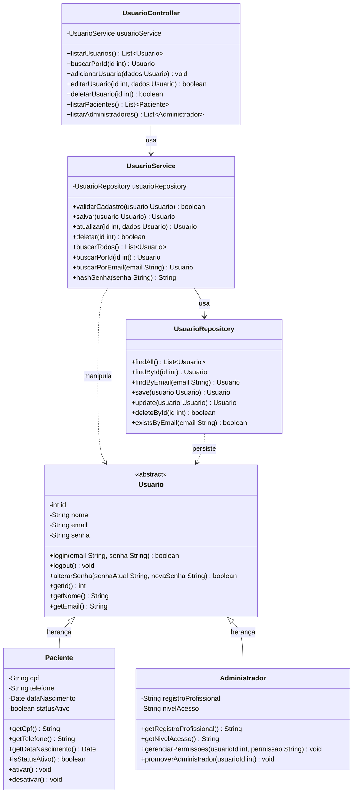

# Projeto Interdisciplinar: Clínica de RPG Maya Yoshiko Yamamoto

## Entrega 1: Programação Orientada a Objetos e Estrutura de Dados

**Integrantes:**
- Luiz Henrique Zaim da Cruz
- Lúcio Vecchio
- Gustavo Diniz Froes
- Gustavo Felizardo Pires

---

