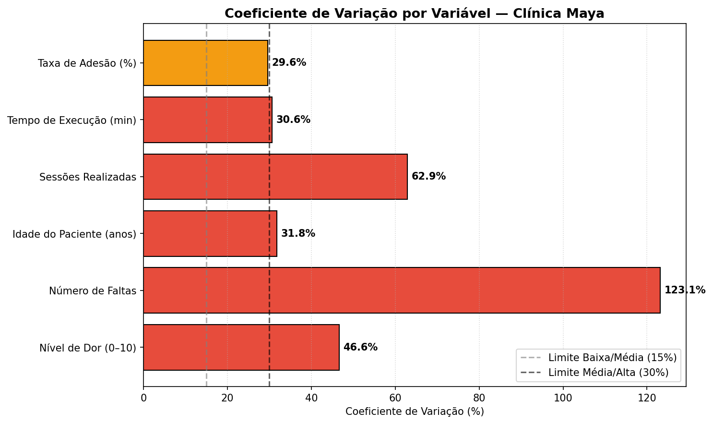
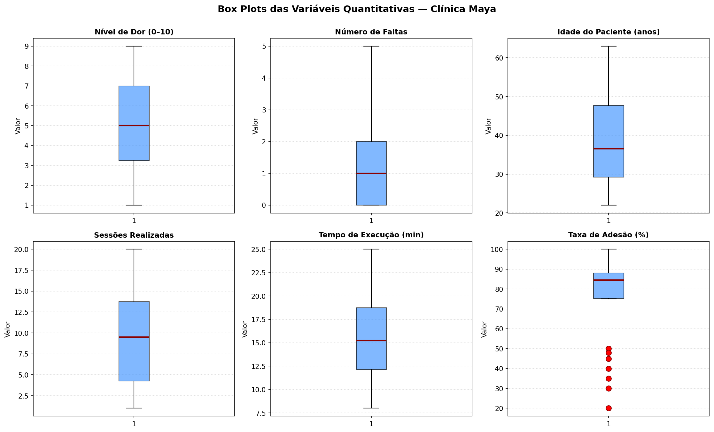
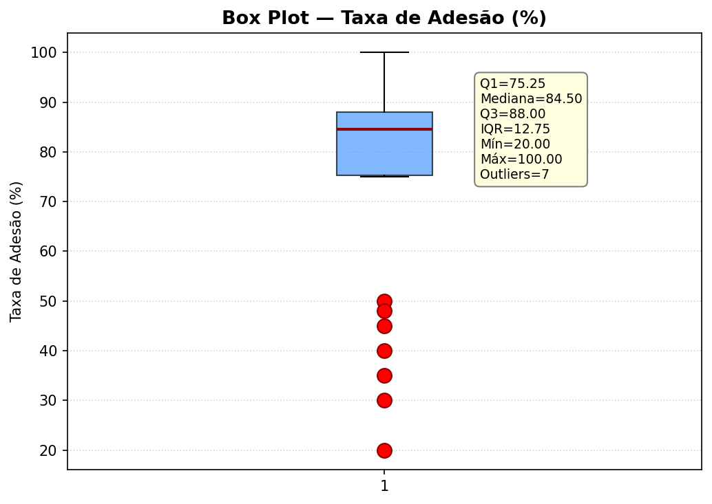
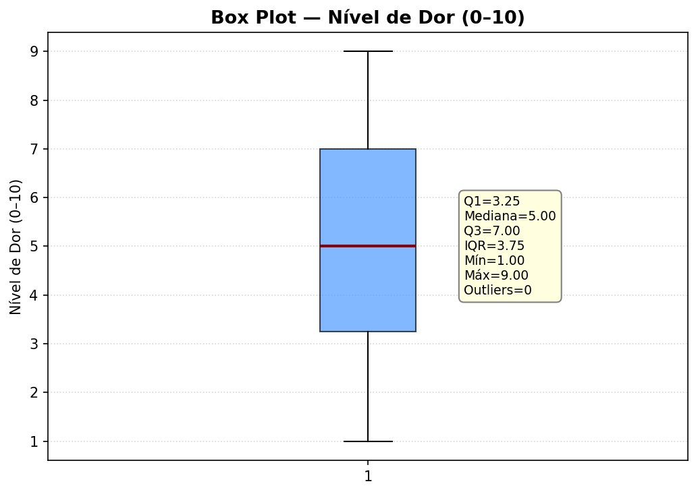
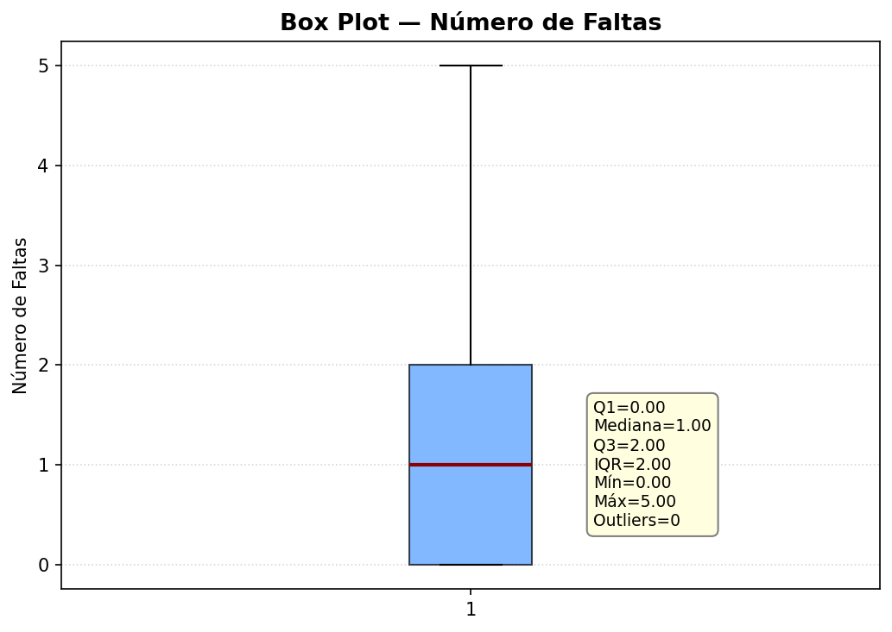
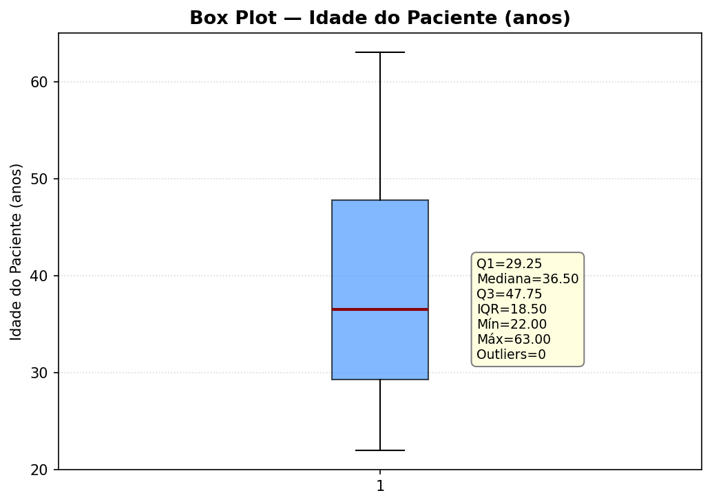
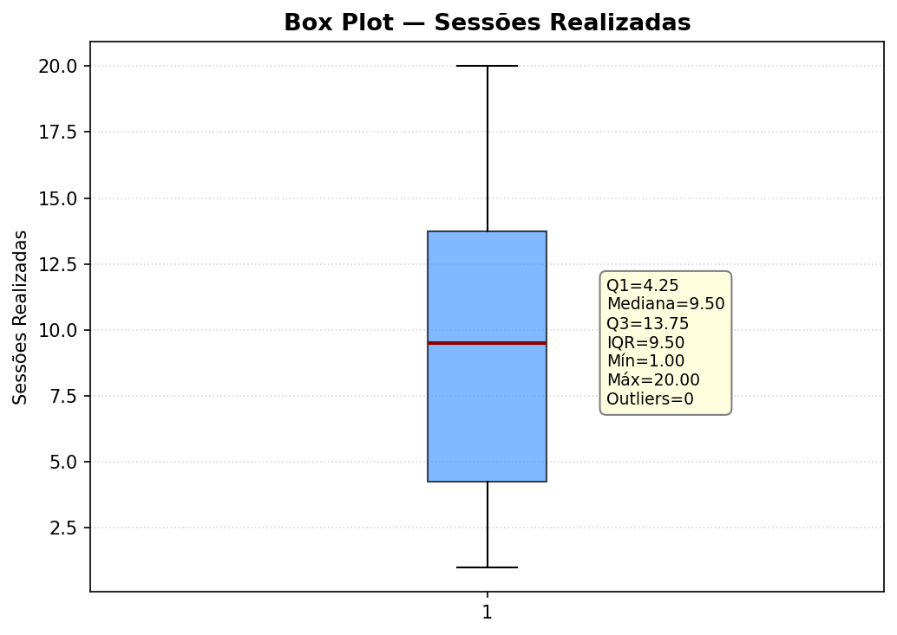
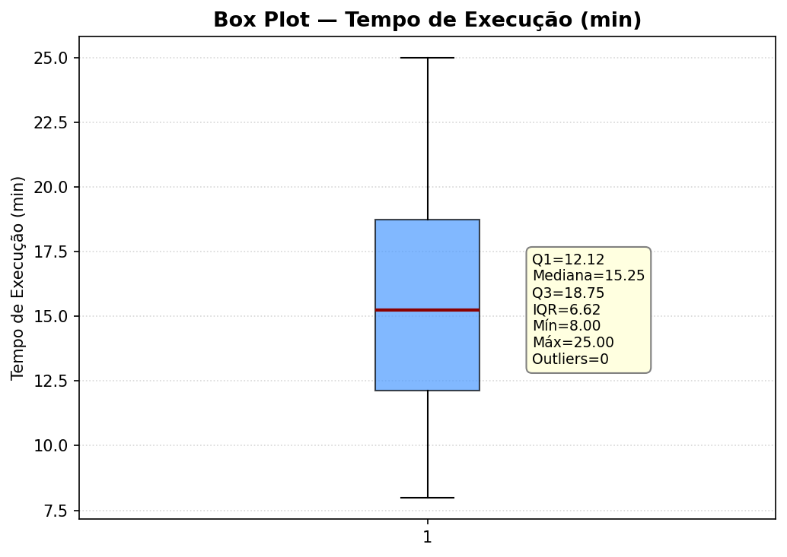

# Projeto Interdisciplinar: Clínica de RPG Maya Yoshiko Yamamoto
**Entrega 2: Análise Descritiva de Dados — Dispersão, Outliers e Probabilidade**

**Nome dos integrantes:** Luiz Henrique Zaim da Cruz, Lúcio Vecchio, Gustavo Diniz Froes, Gustavo Felizardo Pires

---

## 🎯 Objetivo da Entrega 2
Avaliar a **uniformidade** dos dados clínicos da Dra. Maya por meio de **medidas de dispersão (Coeficiente de Variação)**, identificar **outliers** com a técnica do *Box Plot*, analisar a **concentração** dos dados (assimetria) e estimar **probabilidades** de eventos de risco relevantes para a gestão clínica. As conclusões aqui geradas alimentarão os indicadores do *dashboard* do aplicativo, permitindo decisões clínicas baseadas em dados — não em percepção.

🔗 **[Acessar Planilha de Dados no Google Drive](https://docs.google.com/spreadsheets/d/1irdnGa0XCR5whZfa0Xb6prbEp4ETkMaMCcD1yVCKyzk/edit?usp=sharing)**

> **N (amostra):** 30 pacientes  
> **Variáveis quantitativas analisadas:** Nível de Dor, Número de Faltas, Idade, Sessões Realizadas, Tempo de Execução, Taxa de Adesão  
> **Ferramentas:** Google Sheets / Excel para cálculos e Python (pandas + matplotlib) para geração dos *Box Plots*.

---

## 1. Coeficiente de Variação (CV)

> **📌 Conceito:** O Coeficiente de Variação (CV) mede a **dispersão relativa** dos dados em relação à média, permitindo comparar a variabilidade entre variáveis de escalas diferentes (idade em anos vs. dor em pontos, por exemplo).  
>
> **Fórmula:** `CV = (Desvio Padrão / Média) × 100`  
>
> **Classificação adotada (Pimentel-Gomes):**  
> • **CV < 15% → Baixa dispersão** (dados homogêneos)  
> • **15% ≤ CV < 30% → Média dispersão**  
> • **CV ≥ 30% → Alta dispersão** (dados heterogêneos)

### Tabela 1 — Cálculo do CV por Variável

| Variável Quantitativa | Média | Desvio Padrão | CV (%) | Classificação |
| :--- | ---: | ---: | ---: | :---: |
| **Nível de Dor** | 5,07 | 2,36 | **46,63%** | 🔴 Alta |
| **Número de Faltas** | 1,30 | 1,60 | **123,13%** | 🔴 Alta |
| **Idade do Paciente** | 39,23 | 12,46 | **31,77%** | 🔴 Alta |
| **Sessões Realizadas** | 9,40 | 5,92 | **62,94%** | 🔴 Alta |
| **Tempo de Execução (min)** | 15,62 | 4,78 | **30,63%** | 🔴 Alta |
| **Taxa de Adesão (%)** | 75,50 | 22,33 | **29,58%** | 🟡 Média |



---

## 2. Variáveis com Grande Dispersão

Conforme a Tabela 1, **cinco das seis variáveis quantitativas apresentam alta dispersão** (CV ≥ 30%). Destaque para três casos críticos:

### 🔴 Número de Faltas — CV = 123,13% (crítico)
O CV ultrapassa 100%, indicando que o desvio padrão é **maior que a própria média**. Isso significa que o comportamento de faltas é **extremamente heterogêneo**: a clínica tem desde pacientes 100% pontuais (0 faltas) até casos isolados com 4–5 faltas. Não existe um "perfil médio" de faltas — há subgrupos muito distintos coexistindo na base.

### 🔴 Sessões Realizadas — CV = 62,94%
Pacientes apresentam trajetórias muito diferentes: alguns concluem 1–2 sessões (provavelmente desistentes), enquanto outros chegam a 18–20 sessões. Essa heterogeneidade dificulta projeções de capacidade de atendimento.

### 🔴 Nível de Dor — CV = 46,63%
A dor varia de 1 a 9 na amostra, refletindo a diversidade de quadros clínicos atendidos (de casos leves a graves). Embora seja esperado pela natureza do atendimento, o alto CV reforça a necessidade de **estratificar pacientes por grau de severidade** antes de qualquer indicador agregado.

### 🟡 Taxa de Adesão — CV = 29,58%
Tecnicamente classificada como média, mas **muito próxima do limite alto**. Após a remoção de *outliers* (ver item 4), o CV cai drasticamente para **8,24%**, mostrando que a heterogeneidade é puxada por um subgrupo específico (pacientes inativos/desistentes), e não pela base em geral.

---

## 3. Sugestões para Redução da Variabilidade

A redução da variabilidade não significa "manipular dados", mas sim **agir sobre as causas que geram dispersão excessiva**. Para cada variável crítica:

### 📌 Número de Faltas (CV 123%)
- **Notificações push automatizadas** no aplicativo 24 h antes da sessão, com confirmação obrigatória de presença.
- **Política de remarcação flexível** no app: paciente reagenda em 1 clique se houver imprevisto, evitando que vire falta.
- **Alerta para a Dra. Maya** quando o paciente atingir 2 faltas (cruzou o Q3=2), permitindo intervenção precoce — uma ligação ou mensagem personalizada.

### 📌 Sessões Realizadas (CV 63%)
- **Plano terapêutico inicial padronizado** com mínimo recomendado de sessões por grau (Leve: 6, Moderado: 10, Grave: 15), reduzindo a variabilidade entre tratamentos.
- **Gamificação** no aplicativo: marcos a cada 5 sessões com feedback motivacional, incentivando a continuidade até completar o plano.

### 📌 Nível de Dor (CV 47%)
- **Estratificar** os relatórios por grau de alteração postural antes de calcular indicadores — a dispersão é natural quando agregamos casos Leves, Moderados e Graves na mesma média.
- **Protocolo de reavaliação** quando a dor não reduzir em pelo menos 2 pontos após 5 sessões, sinalizando necessidade de ajuste de plano.

### 📌 Taxa de Adesão (CV 30%, puxado por outliers)
- **Onboarding ativo no app** nos primeiros 7 dias: tutoriais, lembretes e check-in diário do fisioterapeuta.
- **Pesquisa de barreiras** (NPS curto) quando a adesão cair abaixo de 60% — identificar se é dor, dificuldade técnica ou desmotivação, e atuar especificamente.

### 📌 Idade (CV 32%)
- Variabilidade aqui é **inerente ao público-alvo** (Dra. Maya atende dos 22 aos 63 anos). **Não cabe redução**, mas sim **segmentação**: criar perfis "Jovem Adulto", "Adulto" e "Idoso" no dashboard para análises separadas.

---

## 4. Box Plot e Análise Exploratória de Outliers

> **📌 Critério de outlier (regra de Tukey):**  
> Um valor é considerado *outlier* se estiver fora do intervalo `[Q1 − 1,5·IQR ; Q3 + 1,5·IQR]`, onde `IQR = Q3 − Q1`.

### Tabela 2 — Cinco Números, Limites e Outliers Detectados

| Variável | Q1 | Mediana (Q2) | Q3 | IQR | Limite Inf. | Limite Sup. | Outliers |
| :--- | ---: | ---: | ---: | ---: | ---: | ---: | :---: |
| Nível de Dor | 3,25 | 5,00 | 7,00 | 3,75 | −2,38 | 12,62 | **0** |
| Número de Faltas | 0,00 | 1,00 | 2,00 | 2,00 | −3,00 | 5,00 | **0** |
| Idade | 29,25 | 36,50 | 47,75 | 18,50 | 1,50 | 75,50 | **0** |
| Sessões Realizadas | 4,25 | 9,50 | 13,75 | 9,50 | −10,00 | 28,00 | **0** |
| Tempo de Execução (min) | 12,12 | 15,25 | 18,75 | 6,62 | 2,19 | 28,69 | **0** |
| **Taxa de Adesão (%)** | 75,25 | 84,50 | 88,00 | 12,75 | **56,12** | 107,12 | **7** |

### Painel de Box Plots


### 🔍 Variável com Outliers: Taxa de Adesão (%)

Sete pacientes apresentaram taxa de adesão abaixo do limite inferior (56,12%), com valores: **{20, 30, 35, 40, 45, 48, 50}**.



**Análise exploratória descartando outliers:**

| Métrica | **Com outliers** (N=30) | **Sem outliers** (N=23) | Variação |
| :--- | ---: | ---: | :--- |
| Média | 75,50% | **86,83%** | +11,33 pp |
| Desvio Padrão | 22,33 | **7,15** | −68% |
| CV | 29,58% | **8,24%** | de 🟡 Média para 🟢 Baixa |

> **💡 Interpretação:** Os 7 *outliers* puxavam a média da clínica para baixo e inflavam a dispersão. Após sua remoção, o perfil real dos pacientes engajados aparece nitidamente: **adesão média de 86,8% com baixíssima variabilidade**. Os outliers, longe de serem "erros", representam um **subgrupo de risco clínico** (provavelmente desistentes) que merece atenção dirigida — não exclusão do tratamento.

### Box Plots individuais (demais variáveis)

| | |
| :---: | :---: |
|  |  |
|  |  |
|  | |

---

## 5. Concentração dos Dados (Assimetria)

> **📌 Conceito:** O coeficiente de **assimetria (skewness)** indica para que lado os dados se inclinam.  
> • **Skew > 0,5** → cauda à direita → **concentração em valores BAIXOS**  
> • **Skew < −0,5** → cauda à esquerda → **concentração em valores ALTOS**  
> • **−0,5 ≤ Skew ≤ 0,5** → aproximadamente simétrica

### Tabela 3 — Assimetria por Variável

| Variável | Skewness | Concentração |
| :--- | ---: | :--- |
| Nível de Dor | −0,304 | Aproximadamente simétrica |
| **Número de Faltas** | **+1,147** | 🔻 **Concentração em valores BAIXOS** (maioria dos pacientes falta pouco) |
| Idade do Paciente | +0,482 | Aproximadamente simétrica |
| Sessões Realizadas | +0,201 | Aproximadamente simétrica |
| Tempo de Execução | +0,353 | Aproximadamente simétrica |
| **Taxa de Adesão** | **−1,220** | 🔺 **Concentração em valores ALTOS** (maioria adere bem ao tratamento) |

### Conclusões sobre a concentração

- **Número de Faltas (skew +1,15):** a clínica tem um núcleo grande de pacientes pontuais (mediana=1 falta), com poucos casos extremos puxando a cauda para cima. **A inadimplência de comparecimento é exceção, não regra** — porém quando ocorre, é severa.
- **Taxa de Adesão (skew −1,22):** confirma a leitura do Box Plot — a maioria dos pacientes apresenta alta adesão, e os baixos valores são outliers identificáveis. Ou seja, **o aplicativo está cumprindo o papel de engajamento** para o grupo majoritário.
- **Demais variáveis (Dor, Idade, Sessões, Tempo):** distribuição balanceada, sem viés relevante — indicador de que o público da clínica é diverso e o tratamento atende um espectro amplo.

---

## 6. Probabilidades de Ocorrência

> **📌 Método:** As probabilidades foram estimadas por **frequência relativa empírica** (P(A) = nº de casos em A ÷ N), por ser o método mais adequado a uma amostra de N=30 sem premissa de normalidade.

### Tabela 4 — Probabilidades de Eventos de Risco

| Evento de Interesse | Casos | N | Probabilidade |
| :--- | :---: | :---: | ---: |
| Paciente com **mais de 3 faltas** | 4 | 30 | **13,33%** |
| Paciente com **mais de 2 faltas** | 7 | 30 | **23,33%** |
| Paciente **Inativo** | 7 | 30 | **23,33%** |
| Paciente com **dor severa (≥7)** | 10 | 30 | **33,33%** |
| Paciente com **baixa adesão (<60%)** | 7 | 30 | **23,33%** |
| Paciente com **grau Grave** | 9 | 30 | **30,00%** |

### Probabilidades Conjuntas e Condicionais

| Evento | Cálculo | Probabilidade |
| :--- | :--- | ---: |
| P(Inativo **e** Faltas>3) | 4 / 30 | **13,33%** |
| P(Inativo \| Faltas>3) | 4 / 4 | **🔥 100,00%** |
| P(Faltas>3 \| Inativo) | 4 / 7 | **57,14%** |

> **💡 Achado crítico:** **100% dos pacientes que faltaram mais de 3 vezes acabaram inativos.** A correlação é perfeita na amostra. Isso transforma a contagem de faltas em um **preditor de evasão**: o aplicativo pode disparar um **alerta automático para a Dra. Maya assim que um paciente atingir a 3ª falta**, abrindo janela para intervenção antes da desistência.

### Aproximação por Modelo Normal (Nível de Dor)

Para fins didáticos, supondo que o Nível de Dor siga uma distribuição aproximadamente normal com `μ=5,07` e `σ=2,36`:

`Z = (7 − 5,07) / 2,36 = 0,818`  
`P(Dor > 7) = 1 − Φ(0,818) ≈ 20,66%`

Comparação:
- **Modelo Normal:** 20,66%
- **Empírica (frequência):** 16,67%

A divergência é pequena (~4 pontos), validando o uso de modelos probabilísticos contínuos para esta variável em projeções futuras com amostras maiores.

---

## 7. Roteiro do Banner

> **📌 Formato sugerido:** A1 (60×84 cm), retrato, fundo claro com paleta verde-acinzentada (identidade Maya).

```
┌──────────────────────────────────────────────────────┐
│  [LOGO MAYA RPG]      CLÍNICA MAYA · ENTREGA 2       │
│                                                      │
│  DA DISPERSÃO À DECISÃO:                             │
│  Dados que evitam a evasão de pacientes              │
│                                                      │
│  ─────────────────────────────────────────────       │
│                                                      │
│  [GRÁFICO 1 — Barras de CV]                          │
│   "5 de 6 variáveis com alta dispersão"              │
│                                                      │
│  [GRÁFICO 2 — Box Plot da Taxa de Adesão]            │
│   "7 outliers escondem o real engajamento"           │
│                                                      │
│  [DESTAQUE NUMÉRICO GIGANTE]                         │
│   100%                                               │
│   dos pacientes com >3 faltas viram INATIVOS         │
│                                                      │
│  ─────────────────────────────────────────────       │
│                                                      │
│  AÇÕES PROPOSTAS                                     │
│  ✓ Alerta automático na 3ª falta                     │
│  ✓ Onboarding ativo no app (7 dias)                  │
│  ✓ Planos padronizados por grau de severidade        │
│                                                      │
│  CONCLUSÃO                                           │
│  Adesão real da clínica = 86,8% (sem outliers)       │
│  Probabilidade de evasão é previsível e gerenciável  │
│                                                      │
│  [QR CODE → Planilha de Dados + Repositório GitHub]  │
│                                                      │
│  Equipe: Luiz Zaim · Lúcio Vecchio · Gustavo Froes   │
│           · Gustavo Felizardo                        │
└──────────────────────────────────────────────────────┘
```

---

## 8. Roteiro do Pitch (4 minutos)

| Tempo | Bloco | Conteúdo | Quem fala |
| :---: | :--- | :--- | :--- |
| **0:00–0:30** | 🎯 Abertura | "Imagine descobrir, com 100% de certeza, qual paciente vai abandonar o tratamento — antes mesmo dele decidir abandonar. Foi exatamente isso que encontramos nos dados da Clínica Maya." | Integrante 1 |
| **0:30–1:30** | 📊 Dispersão (CV) | Apresentar o gráfico de CV. Explicar que 5 de 6 variáveis têm alta dispersão. Destacar **Número de Faltas com CV de 123%** — desvio maior que a média. Posicionar isso como problema: sem padrão, sem previsibilidade. | Integrante 2 |
| **1:30–2:30** | 📦 Outliers (Box Plot) | Mostrar o Box Plot da Taxa de Adesão. Os 7 outliers fazem a média parecer 75%, mas a clínica real tem **86,8% de adesão**. Os outliers não são erro — são **alertas clínicos**. CV cai de 30% para 8% após removê-los. | Integrante 3 |
| **2:30–3:15** | 🎲 Probabilidade & Achado-chave | Apresentar a tabela de probabilidades. Destacar: P(Inativo \| Faltas>3) = **100%**. Cada paciente que falta mais de 3 vezes vira inativo. Isso é um **preditor**, não uma coincidência. | Integrante 4 |
| **3:15–4:00** | 💡 Solução & Impacto Social | Apresentar as 3 ações: alerta na 3ª falta · onboarding 7 dias · planos padronizados. Conclusão: "Análise descritiva não é sobre olhar para o passado — é sobre **transformar dados em prevenção**. Cada paciente que não evade é uma saúde recuperada." | Integrante 1 |

### Pontos de impacto para enfatizar
- **Número-âncora:** "100% — todos os pacientes com >3 faltas viraram inativos."
- **Gancho social:** A clínica atende dos 22 aos 63 anos. Evitar evasão = continuidade do cuidado em saúde para idosos, adultos em reabilitação, jovens com lesões posturais.
- **Visão de produto:** Os achados não ficam no papel — viram **regras de negócio do aplicativo** (alertas, dashboards, fluxos).

---

## 9. Conclusão Geral

A análise de dispersão revelou que a base de pacientes da Clínica Maya é **heterogênea por natureza** (alto CV em 5 de 6 variáveis), mas essa heterogeneidade **não é aleatória**: tem padrão, tem causa e, sobretudo, **tem previsibilidade**.

O Box Plot mostrou que a aparente baixa adesão (75,5%) é, na verdade, **fruto de 7 outliers identificáveis** — sem eles, a clínica opera com 86,8% de adesão e dispersão mínima (CV 8,2%). A assimetria confirmou que a maioria adere bem e falta pouco; os casos extremos são exceção quantificável.

O achado de maior valor clínico veio da análise probabilística: **a probabilidade condicional de um paciente com mais de 3 faltas estar inativo é de 100%** na amostra. Esse insight, sozinho, justifica a criação de uma regra automática no aplicativo — um gatilho de intervenção precoce que pode salvar tratamentos.

Em resumo, as medidas de dispersão e probabilidade transformaram dados brutos em **três decisões acionáveis** para a Dra. Maya: monitorar faltas em tempo real, fazer onboarding ativo nos primeiros 7 dias, e padronizar planos por grau de severidade. **A análise descritiva, aplicada com critério, deixa de descrever o passado e passa a moldar o futuro do cuidado.**

---

### Apêndice — Ferramentas e Reprodutibilidade
- **Planilha bruta:** [Google Sheets](https://docs.google.com/spreadsheets/d/1irdnGa0XCR5whZfa0Xb6prbEp4ETkMaMCcD1yVCKyzk/edit?usp=sharing)  
- **Fórmulas Excel/Sheets utilizadas:**
  - Desvio padrão amostral: `=DESVPAD.A(intervalo)`
  - Coeficiente de Variação: `=DESVPAD.A(intervalo)/MÉDIA(intervalo)*100`
  - Quartis: `=QUARTIL.INC(intervalo; 1)`, `=QUARTIL.INC(intervalo; 3)`
  - Assimetria: `=DISTORÇÃO(intervalo)`
- **Geração dos Box Plots:** Python 3.13 + pandas + matplotlib (script disponível no repositório).
