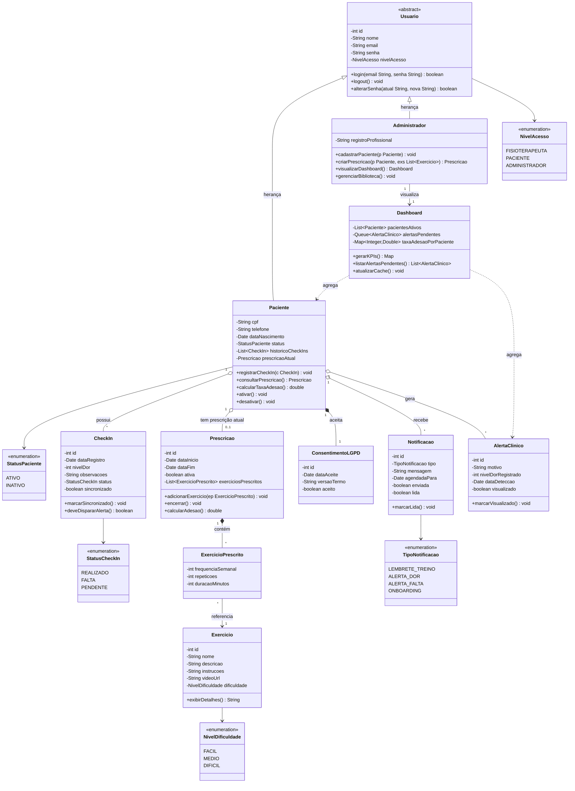

# Projeto Interdisciplinar: Clínica de RPG Maya Yoshiko Yamamoto

## Entrega 2: Programação Orientada a Objetos e Estrutura de Dados — Diagrama de Classes Completo

**Integrantes:**
- Luiz Henrique Zaim da Cruz
- Lúcio Vecchio
- Gustavo Diniz Froes
- Gustavo Felizardo Pires

---

## 🎯 Objetivo da Entrega 2

Expandir o diagrama de classes da [Entrega 1](../../Entrega%201/Programa%C3%A7%C3%A3o%20Orientada%20a%20Objetivos%20e%20Estrutura%20de%20Dados/entrega1.md) — que cobria apenas o domínio de **gestão de usuários** — para um **Diagrama de Classes Completo do Projeto**, contemplando todos os domínios do **Sistema Maya Yamamoto RPG**:

- Hierarquia de usuários (Paciente, Administrador/Fisioterapeuta)
- Domínio clínico (Prescrição, Exercícios, Check-ins)
- Notificações e alertas clínicos
- Dashboard de indicadores
- Conformidade com LGPD

O diagrama também integra as principais **Estruturas de Dados** (Listas, Filas e Mapas) utilizadas na modelagem, atendendo aos dois eixos da disciplina: **POO** + **Estrutura de Dados**.

---

## 🏛️ Arquitetura Adotada

Foi mantido o padrão arquitetural definido na Entrega 1 — **arquitetura em três camadas**, replicada para cada domínio do sistema:

```
        ┌─────────────────────┐
        │     Controller      │   ← Recebe requisições HTTP / chamadas do app
        └──────────┬──────────┘
                   ↓
        ┌─────────────────────┐
        │      Service        │   ← Regras de negócio, validações, orquestração
        └──────────┬──────────┘
                   ↓
        ┌─────────────────────┐
        │     Repository      │   ← Acesso ao banco (PostgreSQL)
        └─────────────────────┘
```

Cada **domínio** (Usuário, Paciente, Exercício, Prescrição, Check-in, Notificação, Dashboard) possui sua própria tríade Controller → Service → Repository, garantindo **baixo acoplamento** e **alta coesão**.

---

## 📦 Diagrama 1 — Modelo de Domínio (Entidades, Enums e Relacionamentos)

Esta primeira visão concentra-se nas **entidades de negócio**, seus atributos, relacionamentos e nas estruturas de dados que cada uma encapsula.



---

## 🧱 Diagrama 2 — Camadas de Aplicação (Controllers, Services e Repositories)

Esta segunda visão mostra como as entidades acima são manipuladas pela arquitetura em três camadas. Cada domínio possui sua tríade própria, e os serviços se compõem entre si quando há regra de negócio cruzada (ex.: `CheckInService` delega para `AlertaService` quando o nível de dor é alto).

```mermaid
classDiagram
    %% ========== CONTROLLERS ==========
    class UsuarioController {
        -UsuarioService service
        +listar() List~Usuario~
        +buscarPorId(id int) Usuario
        +cadastrar(u Usuario) Usuario
        +editar(id int, dados Usuario) boolean
        +deletar(id int) boolean
    }

    class PacienteController {
        -PacienteService service
        +listarAtivos() List~Paciente~
        +consultarHistorico(id int) List~CheckIn~
        +ativar(id int) void
        +desativar(id int) void
    }

    class ExercicioController {
        -ExercicioService service
        +listar() List~Exercicio~
        +cadastrar(e Exercicio) Exercicio
        +buscarPorDificuldade(nv NivelDificuldade) List~Exercicio~
    }

    class PrescricaoController {
        -PrescricaoService service
        +criarPrescricao(idPaciente int, exs List~ExercicioPrescrito~) Prescricao
        +listarPorPaciente(id int) List~Prescricao~
        +encerrarVigente(idPaciente int) void
    }

    class CheckInController {
        -CheckInService service
        +registrar(c CheckIn) CheckIn
        +sincronizarLote(fila Queue~CheckIn~) void
        +listarPorPaciente(id int) List~CheckIn~
    }

    class NotificacaoController {
        -NotificacaoService service
        +agendar(n Notificacao) void
        +listarPendentes() List~Notificacao~
    }

    class DashboardController {
        -DashboardService service
        +consultarKPIs() Map
        +listarAlertasAtivos() List~AlertaClinico~
    }

    %% ========== SERVICES ==========
    class UsuarioService {
        -UsuarioRepository repo
        +validarCadastro(u Usuario) boolean
        +salvar(u Usuario) Usuario
        +autenticar(email String, senha String) Token
        +hashSenha(senha String) String
    }

    class PacienteService {
        -PacienteRepository repo
        -UsuarioService usuarioService
        +cadastrarComConsentimento(p Paciente, lgpd ConsentimentoLGPD) Paciente
        +ativar(id int) void
        +desativar(id int) void
        +calcularTaxaAdesao(id int) double
    }

    class ExercicioService {
        -ExercicioRepository repo
        +cadastrar(e Exercicio) Exercicio
        +buscarPorFiltros(filtros Map) List~Exercicio~
    }

    class PrescricaoService {
        -PrescricaoRepository repo
        +criar(idPaciente int, exs List~ExercicioPrescrito~) Prescricao
        +encerrarVigente(idPaciente int) void
    }

    class CheckInService {
        -CheckInRepository repo
        -AlertaService alertaService
        +registrar(c CheckIn) CheckIn
        +processarFilaSincronizacao(fila Queue~CheckIn~) void
        +avaliarAlertaDor(c CheckIn) AlertaClinico
    }

    class AlertaService {
        -AlertaRepository repo
        +gerarAlerta(c CheckIn) AlertaClinico
        +listarPendentes() List~AlertaClinico~
    }

    class NotificacaoService {
        -NotificacaoRepository repo
        -Queue~Notificacao~ filaEnvio
        +enfileirar(n Notificacao) void
        +processarFila() void
    }

    class DashboardService {
        -PacienteRepository pacienteRepo
        -CheckInRepository checkinRepo
        -AlertaRepository alertaRepo
        -Map~Integer,Double~ cacheAdesao
        +gerarKPIs() Map
        +consultarAlertasPendentes() List~AlertaClinico~
        +invalidarCache() void
    }

    %% ========== REPOSITORIES ==========
    class UsuarioRepository {
        +findAll() List~Usuario~
        +findById(id int) Usuario
        +findByEmail(email String) Usuario
        +save(u Usuario) Usuario
        +update(u Usuario) Usuario
        +deleteById(id int) boolean
    }

    class PacienteRepository {
        +findByStatus(s StatusPaciente) List~Paciente~
        +findAtivos() List~Paciente~
        +countFaltas(id int) int
    }

    class ExercicioRepository {
        +findAll() List~Exercicio~
        +findByDificuldade(nv NivelDificuldade) List~Exercicio~
        +save(e Exercicio) Exercicio
    }

    class PrescricaoRepository {
        +findByPaciente(id int) List~Prescricao~
        +findVigente(idPaciente int) Prescricao
        +save(p Prescricao) Prescricao
    }

    class CheckInRepository {
        +findByPaciente(id int) List~CheckIn~
        +findPendentesSincronizacao() List~CheckIn~
        +save(c CheckIn) CheckIn
    }

    class NotificacaoRepository {
        +findAgendadas() List~Notificacao~
        +save(n Notificacao) Notificacao
    }

    class AlertaRepository {
        +findPendentes() List~AlertaClinico~
        +save(a AlertaClinico) AlertaClinico
    }

    %% ========== DEPENDÊNCIAS ENTRE CAMADAS ==========
    UsuarioController --> UsuarioService : usa
    PacienteController --> PacienteService : usa
    ExercicioController --> ExercicioService : usa
    PrescricaoController --> PrescricaoService : usa
    CheckInController --> CheckInService : usa
    NotificacaoController --> NotificacaoService : usa
    DashboardController --> DashboardService : usa

    UsuarioService --> UsuarioRepository : usa
    PacienteService --> PacienteRepository : usa
    PacienteService --> UsuarioService : compõe
    ExercicioService --> ExercicioRepository : usa
    PrescricaoService --> PrescricaoRepository : usa
    CheckInService --> CheckInRepository : usa
    CheckInService --> AlertaService : delega
    AlertaService --> AlertaRepository : usa
    NotificacaoService --> NotificacaoRepository : usa
    DashboardService --> PacienteRepository : consulta
    DashboardService --> CheckInRepository : consulta
    DashboardService --> AlertaRepository : consulta
```



---

## 📋 Detalhamento por Domínio

### 1. Hierarquia de Usuários
A classe **`Usuario`** permanece como classe abstrata (raiz da hierarquia), com os atributos comuns (`id`, `nome`, `email`, `senha`) e as operações de autenticação. Suas duas especializações são:

- **`Paciente`**: pessoa física em tratamento. Possui CPF, telefone, data de nascimento, status (Ativo/Inativo) e mantém uma **lista (`List<CheckIn>`)** com seu histórico clínico. Sua prescrição atual (`Prescricao`) é uma referência opcional (cardinalidade `0..1`).
- **`Administrador`**: profissional da clínica (Dra. Maya). Tem `registroProfissional` (CREFITO) e é o ator que cadastra pacientes, prescreve treinos e consulta o dashboard.

### 2. Domínio Clínico (Prescrição e Exercícios)
- **`Exercicio`** representa uma entidade reusável da biblioteca da clínica (nome, descrição, instruções, vídeo demonstrativo, nível de dificuldade).
- **`Prescricao`** é o vínculo do paciente com seu plano terapêutico. Contém uma **lista (`List<ExercicioPrescrito>`)** que mantém a ordem definida pela fisioterapeuta.
- **`ExercicioPrescrito`** é uma **classe de associação**: representa "qual exercício, com qual frequência semanal, quantas repetições e quantos minutos" para aquele paciente específico. Esse desenho evita duplicar exercícios na biblioteca quando o que muda é só a dosagem.

### 3. Domínio de Acompanhamento (Check-ins e Alertas)
- **`CheckIn`** é o registro diário do paciente no app: data, nível de dor (0–10), observações livres, status (Realizado / Falta / Pendente) e flag de sincronização (`sincronizado: boolean`) — relevante para o modo **offline-first** do app.
- **`AlertaClinico`** é gerado automaticamente sempre que um Check-in chega com `nivelDor >= 7`. Aparece imediatamente no dashboard da fisioterapeuta como notificação visual vermelha.

### 4. Domínio de Notificações
- **`Notificacao`** modela os lembretes do `AlarmManager` do Android (lembrete diário de treino) e os push-notifications de onboarding/alerta de faltas.
- O `NotificacaoService` mantém uma **fila (`Queue<Notificacao>`)** que é processada em ordem FIFO pela rotina de envio.

### 5. Conformidade e Dashboard
- **`ConsentimentoLGPD`** é uma entidade obrigatória, em **composição forte** com `Paciente` (cardinalidade `1..1`): nenhum paciente existe sem registro de aceite do termo.
- **`Dashboard`** é uma view model que agrega: lista de pacientes ativos, fila de alertas pendentes e mapa de taxa de adesão por paciente (cache para evitar recálculos).

---

## 🗂️ Estruturas de Dados Utilizadas

Como a disciplina abrange tanto POO quanto **Estrutura de Dados**, a escolha de cada coleção foi feita com base no padrão de acesso esperado:

| Estrutura | Onde é usada | Justificativa |
| :--- | :--- | :--- |
| **`List<CheckIn>`** | `Paciente.historicoCheckIns` | Ordem cronológica importa; iteração linear frequente para gerar gráficos de evolução da dor. |
| **`List<ExercicioPrescrito>`** | `Prescricao.exerciciosPrescritos` | Ordem definida pela fisioterapeuta é parte do plano — listas preservam essa ordem. |
| **`Queue<Notificacao>`** | `NotificacaoService.filaEnvio` | Push notifications são processadas em **FIFO** — a ordem de agendamento deve ser respeitada. |
| **`Queue<AlertaClinico>`** | `Dashboard.alertasPendentes` | Alertas são atendidos pela fisioterapeuta na ordem em que chegam, garantindo que o mais antigo não fique esquecido. |
| **`Queue<CheckIn>`** | Sincronização offline-first do app | Quando o paciente está sem internet, os check-ins ficam enfileirados localmente (SQLite) e são enviados em ordem assim que a conexão volta. |
| **`Map<Integer, Double>`** | `DashboardService.cacheAdesao` | Lookup **O(1)** da taxa de adesão por ID de paciente, evitando recalcular a cada renderização do dashboard. |
| **`Map<String, ?>`** | KPIs do Dashboard (`gerarKPIs()`) | Chaves textuais (`"pacientesAtivos"`, `"alertasHoje"`, `"adesaoMedia"`) facilitam serialização para JSON na API. |

---

## 🔗 Mapeamento para a Implementação Real

O sistema final foi implementado em **Node.js + Express** (backend) e **Next.js + React** (web), tecnologias que não impõem classes no estilo Java. Contudo, o **paradigma orientado a objetos foi preservado** por meio de:

- **Módulos por domínio**: cada pasta do backend agrupa Controller + Service + Repository (mesma divisão do diagrama).
- **Classes ES6 / `class` keyword** nos serviços com estado (ex.: `NotificacaoService` que mantém a fila em memória).
- **Tipagem TypeScript** no frontend: cada entidade do diagrama tem sua `interface` correspondente em `src/types/`.
- **No banco PostgreSQL**: cada classe vira uma tabela; as listas viram tabelas filhas (1:N); os enums viram tipos `CHECK` ou `ENUM` no SQL.

---

## ✅ Conclusão

O **Diagrama de Classes Completo** representa toda a superfície do Sistema Maya Yamamoto RPG, distribuída em **11 entidades de domínio**, **5 enumerações** e **21 classes da camada de aplicação** (7 Controllers + 8 Services + 7 Repositories), totalizando **45 classes** organizadas em uma arquitetura limpa e de baixo acoplamento.

A combinação de **POO** (herança, composição, encapsulamento) com **Estruturas de Dados** (listas, filas e mapas) garante que o sistema seja ao mesmo tempo **expansível** (novos domínios seguem o mesmo padrão Controller/Service/Repository) e **eficiente** (estruturas escolhidas conforme o padrão de acesso de cada caso de uso).

Este diagrama serve como contrato técnico para o desenvolvimento e como referência para futuras manutenções, garantindo que qualquer novo desenvolvedor entenda em minutos a estrutura completa do sistema.
